  

  <h1 align="center">
    
  </h1>

<table align="center" border="0" cellpadding="0" cellspacing="0">
  <tr align="center">
      <blockquote>
        <h3>Credo nell'eleganza della semplicità per risolvere problemi complessi.</h3>
      </blockquote>
    </td>
  </tr>
</table>

  
    
  
  
  
  

  <h3>🌱 Attualmente sto approfondendo:</h3>
  <ul>
    <li><b>Java</b> per lo sviluppo <b>backend</b>.</li>
    <li>Sviluppo App mobile con <b>Flutter</b> e <b>Dart</b>.</li>
    <li><b>C++</b> in <b>Unreal Engine</b> per lo sviluppo di videogiochi e simulazioni.</li>
  </ul>

  <h3>🚀 Il Mio Stack Tecnologico</h3>
  

    
    
    
    
    
    
  

  <h3>📊 Le Mie Statistiche su GitHub</h3>
  
    
  

